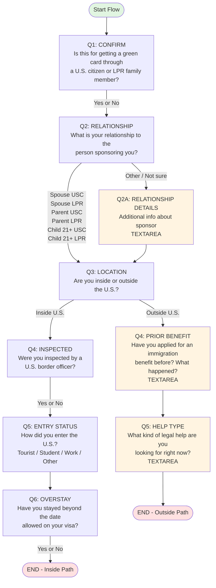

# Family-Based Green Card Flow - Screen Documentation

## Flow Overview
**Case Type:** Green Card through a Spouse or Family Member ("Family-Based Green Card")  
**Flow ID:** `family-based-immigrant-visa-immediate-relative`

---

## Visual Flowchart

---

## Detailed Question Breakdown

### **Q1: CONFIRM** (Radio)
**Question ID:** `confirm`  
**Type:** Confirm (Yes/No)  
**Required:** Yes

**Prompt:**
> "Great! This is for people getting a green card through a U.S. citizen or lawful permanent resident family member (such as a spouse, parent, or child). Is that your situation?"

**Options:**
- Yes
- No

**Next Step:** → Q2 (relationship) - *regardless of answer*

---

### **Q2: RELATIONSHIP** (Single Select)
**Question ID:** `relationship`  
**Type:** Single choice  
**Required:** Yes

**Prompt:**
> "What is your relationship to the person sponsoring you, and their status?"

**Options:**
- Spouse (U.S. citizen)
- Spouse (green card holder)
- Parent (U.S. citizen)
- Parent (green card holder)
- Child, 21+ (U.S. citizen)
- Child, 21+ (green card holder)
- Other / Not sure

**Next Step:**
- If answer = **"Other / Not sure"** → Q2A (relationship_other_details)
- If answer = **any other option** → Q3 (location)

---

### **Q2A: RELATIONSHIP DETAILS** (Text Area) *[Conditional]*
**Question ID:** `relationship_other_details`  
**Type:** Textarea  
**Required:** Yes  
**Visible If:** User selected "Other / Not sure" in Q2

**Prompt:**
> "Please provide additional information about the person sponsoring you."

**Next Step:** → Q3 (location)

---

### **Q3: LOCATION** (Single Select)
**Question ID:** `location`  
**Type:** Single choice  
**Required:** Yes

**Prompt:**
> "Are you inside the U.S. right now, or outside the U.S.?"

**Options:**
- Inside the U.S.
- Outside the U.S.

**Next Step:**
- If answer = **"Inside the U.S."** → Q4 Inside Path (inside_inspected)
- If answer = **"Outside the U.S."** → Q4 Outside Path (outside_prior_benefit)

---

## INSIDE U.S. PATH

### **Q4: INSPECTED** (Single Select) *[Inside Path Only]*
**Question ID:** `inside_inspected`  
**Type:** Single choice  
**Required:** Yes  
**Visible If:** User selected "Inside the U.S." in Q3

**Prompt:**
> "When you entered the U.S., were you inspected by a U.S. border officer?"

**Options:**
- Yes - I was inspected and admitted
- No - I entered without being inspected

**Next Step:** → Q5 (inside_entry_status) - *regardless of answer*

---

### **Q5: ENTRY STATUS** (Single Select) *[Inside Path Only]*
**Question ID:** `inside_entry_status`  
**Type:** Single choice  
**Required:** Yes  
**Visible If:** User selected "Inside the U.S." in Q3

**Prompt:**
> "How did you enter the U.S.?"

**Options:**
- Tourist visa
- Student visa
- Work visa
- Other / Not sure

**Next Step:** → Q6 (inside_overstay) - *regardless of answer*

---

### **Q6: OVERSTAY** (Single Select) *[Inside Path Only]*
**Question ID:** `inside_overstay`  
**Type:** Single choice  
**Required:** Yes  
**Visible If:** User selected "Inside the U.S." in Q3

**Prompt:**
> "Have you stayed in the U.S. beyond the date allowed on your visa or entry status?"

**Options:**
- Yes
- No

**Next Step:** → **END** (Flow complete)

---

## OUTSIDE U.S. PATH

### **Q4: PRIOR BENEFIT** (Text Area) *[Outside Path Only]*
**Question ID:** `outside_prior_benefit`  
**Type:** Textarea  
**Required:** Yes  
**Visible If:** User selected "Outside the U.S." in Q3

**Prompt:**
> "Have you ever applied for an immigration benefit before? If yes, what happened?"

**Next Step:** → Q5 (outside_help_type)

---

### **Q5: HELP TYPE** (Text Area) *[Outside Path Only]*
**Question ID:** `outside_help_type`  
**Type:** Textarea  
**Required:** Yes  
**Visible If:** User selected "Outside the U.S." in Q3

**Prompt:**
> "What kind of legal help are you looking for right now?"

**Next Step:** → **END** (Flow complete)

---

## Flow Summary

### Total Questions
- **Main Path:** 3 questions (Confirm, Relationship, Location)
- **Inside U.S. Branch:** 6 total questions
- **Outside U.S. Branch:** 5 total questions
- **Conditional Questions:** 3 (relationship_other_details, inside path questions, outside path questions)

### Question Types
- **Single Select (Radio):** 5 questions
- **Text Area:** 3 questions
- **Confirm (Yes/No):** 1 question

### Branching Points
1. **Q2 (Relationship):** Branches to optional details if "Other" selected
2. **Q3 (Location):** Major branch - splits into Inside/Outside U.S. paths

---

## Implementation Files
- **Question Prompts:** `translations/en.json` (line 61-119) and `translations/es.json`
- **Flow Logic:** `client/src/lib/translations.ts` (line 34-113)
- **Modal Component:** `client/src/components/NewQuoteModal.tsx`

---

## Notes for Revisions
- All questions in the flow are currently marked as **required**
- The flow uses conditional visibility (`visibleIf`) for path-specific questions
- Both paths (Inside/Outside) have equal depth but different question types
- The Inside path uses more structured single-choice questions
- The Outside path uses more open-ended textarea questions

---

## Editing Instructions

To modify this flow:

1. **Update Question Text:**
   - Edit prompts in `translations/en.json` under `quoteModal.flows.family-based-immigrant-visa-immediate-relative`
   - Update Spanish version in `translations/es.json`

2. **Change Flow Logic:**
   - Modify the `next` functions in `client/src/lib/translations.ts`
   - Example: Change branching logic based on different answers

3. **Add/Remove Questions:**
   - Add new question objects in both translation files
   - Add corresponding node in `client/src/lib/translations.ts`
   - Update `next` functions to route to new questions

4. **Change Question Types:**
   - Available types: `confirm`, `single`, `multi`, `text`, `textarea`, `date`
   - Update the `kind` property in the node definition
